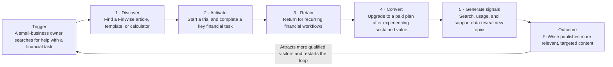

# The Bet · FinWise

> Module 1 · Ignite a PLG Motion. The growth hypothesis and where you're betting, plus the growth-loop visualization.

## Growth hypothesis

*The core belief: if we do X, then Y, because Z.*

Based on the data, I believe FinWise's biggest growth problem is converting website visitors into trial users because only 6.79% of visitors start a trial—representing a 93.21% drop-off—and the visit-to-trial conversion rate varies substantially by month. The highest-leverage experiment I would run first is a content-driven landing-page test that pairs high-intent financial guidance with a clear, contextually relevant trial call to action.

If FinWise pairs useful, high-intent financial content with a relevant trial call to action, then the visit-to-trial conversion rate will increase because visitors will understand FinWise's value in the context of the financial task they are already trying to complete.

_____

## The bet

*Where you focus, and what you're deliberately NOT doing.*

FinWise will focus first on improving the transition from website visit to trial start through a content-driven acquisition loop. The initial bet is to create or select one high-intent financial resource, connect it to a closely matched product use case, and test its landing page and trial call to action against the current experience.

FinWise is deliberately not increasing paid-acquisition spend, building a multi-step onboarding flow, or launching referral and collaboration loops at this stage. Those options depend on assumptions that the available data does not yet validate, while the largest measurable drop-off currently occurs before the trial begins.

_____

## Growth loop

*A link or image of the loop that compounds (acquisition → activation → retention → revenue → renewed acquisition).*

**Trigger**: A small-business owner searches for help with a financial-management task and discovers a FinWise article, template, or calculator.

**Stage 1 — Discover**: The visitor uses the content to understand the task and sees how FinWise can help apply the guidance to their business.

**Stage 2 — Activate**: The visitor starts a trial, enters or imports business data, and completes a key financial-management action.

**Stage 3 — Retain**: The user returns to FinWise for recurring financial workflows and experiences sustained value.

**Stage 4 — Convert**: The retained user upgrades to a paid plan.

**Stage 5 — Generate signals**: Aggregated search, product-usage, and support data reveal additional high-interest topics that FinWise can address through useful, searchable content.

**Outcome**: FinWise publishes more relevant content, attracting additional qualified small-business visitors and restarting the loop with a larger audience.

_____
