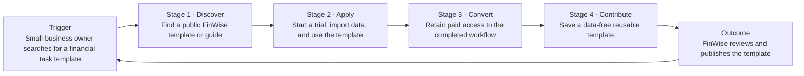

# The Bet · FinWise

> Module 1 · Ignite a PLG Motion

## Growth hypothesis

### Hypothesis

> **If** FinWise shows trial users who have imported their data and completed a financial-modeling action a clear in-product paid-plan continuation prompt, **then** trial-to-paid conversion will increase from **1.99% to 2.4%** over the two-week trial period, **because** users who have completed key product actions may have experienced enough product value for a contextual paid-plan prompt to influence their decision to convert.

### Evidence behind the hypothesis

- Across the 13 months of funnel data, **6,424 trials** produced **128 paid conversions**: a **1.99% trial-to-paid conversion rate**.
- Trial-to-paid conversion was between **1.87% and 2.08%** in every month of the dataset.
- Trial-to-paid is the smallest stage conversion rate in the measured funnel: **6.79%** of website visits become trials, compared with **1.99%** of trials becoming paid customers.

### Measurement plan

| Item | Definition |
| --- | --- |
| Method | Randomized A/B test: existing trial experience vs. contextual paid-plan continuation prompt after both key actions are complete. |
| Duration | Two weeks, covering the standard reverse-trial window. |
| Primary metric | Trial-to-paid conversion rate. |
| Success threshold | Increase from 1.99% to at least 2.4%. |
| Guardrail | Data-import and financial-modeling completion do not decline by more than 5% relative to control. |

---

## The bet

### Where FinWise will focus

FinWise will first test the **Revenue** stage: the transition from trial to paid. The bet is that a contextual paid-plan continuation prompt, shown only after a trial user has completed meaningful product actions, will increase the share of trial users who become paid customers.

### Why this bet comes first

1. It targets the stage closest to FinWise’s business outcome: paid customers.
2. A one-percentage-point improvement in trial-to-paid conversion would add about **64 paid customers** at the observed 6,424-trial volume; a one-point improvement in visit-to-trial conversion would yield about **19 paid customers** if the current trial-to-paid rate remained unchanged.
3. The 1.99% trial-to-paid rate is low and consistently narrow across the observed months, rather than being driven by one unusual month.

### What FinWise will not do first

- Increase paid-acquisition spend.
- Make a broad homepage or trial-start redesign the primary experiment.
- Launch referral or collaboration loops before testing whether the current trial base converts more effectively.

FinWise will continue to monitor visit-to-trial conversion because it represents the largest absolute volume drop, but it is not the first validation bet.

---

## Content-driven growth loop

This is the acquisition loop FinWise will develop first. It complements the Revenue experiment above: useful, searchable templates bring in qualified prospects; the trial experience then creates the opportunity to convert them to paid customers.

### Descriptive steps

1. **Trigger — Financial task need:** A small-business owner searches for help with a specific task, such as cash-flow forecasting or budgeting.
2. **Discover:** They find a public FinWise template or guide that addresses that task.
3. **Apply:** They start a reverse trial, import their business data, and use the template to complete a financial workflow.
4. **Convert:** After experiencing the completed workflow, they retain paid access to FinWise.
5. **Contribute:** A user saves a reusable, data-free template rather than sharing sensitive financial reports.
6. **Outcome — New discoverable content:** FinWise reviews and publishes high-quality templates, giving the next small-business owner a resource to find and restarting the loop.

### Friction removed

The loop does **not** rely on customers publicly sharing financial reports, which may contain sensitive information and may not be discoverable. It uses reusable templates with no customer financial data as the content asset that can safely be published and found by future prospects.
