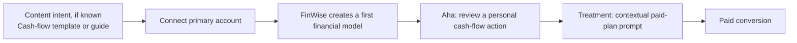

# The Solution · FinWise

Module 2 · Acquisition & Activation. The onboarding solution and the Aha moment that makes value land.

## Recrafted exercise: onboarding in service of the Module 1 bet

Module 1 established that FinWise will first test the **Revenue** stage: increasing trial-to-paid conversion from the 1.99% baseline with a contextual paid-plan continuation prompt. The onboarding flow exists to get a new trial user to the qualifying value event before that prompt is shown.
## Strategy context

### The aligned activation chain
FinWise is a financial-management SaaS product for small businesses with a product-led reverse-trial model. Module 1 identified the **Revenue** stage—trial to paid—as the first experiment priority: only **128 of 6,424 trials converted** in the 13-month dataset, a **1.99% trial-to-paid conversion rate**.

The Module 1 hypothesis is that showing eligible trial users a contextual paid-plan continuation prompt will improve trial-to-paid conversion from **1.99% to 2.4%**. Eligibility must follow a demonstrated product-value event, not happen during early setup. Module 2 therefore designs the shortest path from sign-up to that event.

### Candidate Aha moment

**A trial user reviews a recommended cash-flow action from a first financial model generated using their connected business account.**

This deliberately combines the two Module 1 qualifying behaviors:
> **A trial user reviews a recommended cash-flow action from a first financial model generated using their connected business account.**

1. the user imports or connects real account data; and
2. the user completes the first financial-modeling action by reviewing the resulting recommended action.
This is the first point at which FinWise transforms account data into a clear answer to a practical small-business question—whether cash will remain above a preferred buffer—and suggests a concrete action. Connecting an account is setup; reviewing the modeled recommendation is the candidate value moment.

**Activation event:** `personalized_cashflow_action_reviewed`
**Candidate activation event:** `personalized_cashflow_action_reviewed`

The event is a candidate Aha moment—not a proven predictor. FinWise should validate that users who complete it convert and retain at higher rates than comparable trial users who do not.
This is a testable candidate, not a proven causal event. FinWise should later compare conversion and retention for users who complete it with comparable users who do not.

---

## Minimum treatment path: four screens
## Onboarding plan

The flow begins after sign-up and is intentionally designed as the **treatment** for the Module 1 experiment. The contextual paid-plan prompt appears only after Aha, never before it.
The onboarding path contains **three steps to Aha**. The paid-plan prompt is a distinct post-Aha treatment in the Module 1 Revenue experiment, not a prerequisite for activation.

| Screen | Single job | One action requested | Module 1 connection |
| --- | --- | --- | --- |
| **1. Confirm first goal** | Set the first valuable question to answer. | **Confirm “See my upcoming cash flow.”** | Pre-fill from a cash-flow template, guide, or campaign when acquisition intent is known. |
| **2. Connect primary account** | Obtain the minimum real data needed for a personal forecast. | **Connect account.** | Satisfies the data-import condition. |
| **3. Personal cash-flow action** | Show the first model and let the user inspect one recommended action. | **Review recommended action.** | Completion records `personalized_cashflow_action_reviewed`: the Aha / qualifying event. |
| **4. Continue with FinWise** | Present the contextual paid-plan continuation prompt after demonstrated value. | **Continue to paid plan.** | This is the Module 1 treatment. The control experience omits this prompt at this point. |
| Stage | Single job | One user action | Personalization / friction removal | Event or output |
| --- | --- | --- | --- | --- |
| **1. Confirm first goal** | Establish the first financial question FinWise will answer. | Confirm **“See my upcoming cash flow.”** | For users arriving from a cash-flow template, guide, or campaign, pre-fill this goal; when confidence is high, skip the screen entirely. Users with unknown intent see one goal question, not a multi-question quiz. | First goal confirmed. |
| **2. Connect primary account** | Get the minimum real data needed for the first model. | Select **“Connect account.”** | Ask for one primary business account only. Do not ask for manual categorization, additional accounts, company-profile details, or team invitations. | Account connected / data imported. |
| **3. Review personal cash-flow action** | Turn the connected account data into a forecast and concrete recommended action. | Select **“Review recommended action.”** | The screen uses the connected account and the chosen goal to make the first result personal and focused. | `personalized_cashflow_action_reviewed` — candidate Aha event. |
| **Post-Aha treatment** | Offer continued paid access only after the user has seen value. | Select **“Continue to paid plan.”** | Include **“Not now — continue my trial”** as a clear secondary choice. No discounts, pressure, or complex pricing comparison. | Module 1 treatment; trial-to-paid conversion. |

### Personalization rules

- **Known acquisition intent:** If a user starts from cash-flow content, pre-fill the goal and, where confidence is high, skip Screen 1 entirely. The shortest path is then **account connection → Aha → treatment prompt**.
- **No known intent:** Ask one goal-selection question only. Do not use a multi-question personalization quiz.
- **Real data:** Create the first model from the primary connected account. Do not request manual categorization, additional accounts, company profiles, or team invitations before Aha.

### Deliberately excluded before Aha

- Product tour and feature menus
- Additional account connections
- Team invitations
- Manual transaction categorization
- Billing collection or pricing comparison before Screen 4
- Notifications, settings, and unrelated preferences
- Notification preferences and settings
- Billing, pricing comparison, or upgrade prompts before the post-Aha treatment

---

## Prototype mapping

 

https://finwise-onboarding-p-7fon.bolt.host

## Experiment specification

| Prototype view | Role in the onboarding strategy |
| --- | --- |
| Population | New reverse-trial users who connect a primary account and reach the candidate Aha event. |
| Control | Existing post-Aha trial experience, without the contextual paid-plan continuation prompt at this moment. |
| Treatment | The four-screen path above, including Screen 4 immediately after `personalized_cashflow_action_reviewed`. |
| Primary metric | Trial-to-paid conversion rate. |
| Success threshold | Improve trial-to-paid conversion from 1.99% to at least 2.4%. |
| Activation diagnostic | Share of new trials completing `personalized_cashflow_action_reviewed`. |
| Guardrails | Bank-connection failure rate, onboarding abandonment, time to Aha, and data-import / modeling completion. |
| **“Let’s get your cash flow clear.”** | Step 1: confirms the cash-flow goal. The prototype shows it pre-filled from a cash-flow guide, preserving acquisition intent. |
| **“Connect your primary business account.”** | Step 2: explains that one account is sufficient, then captures the minimum data required for the forecast. The disconnected and connected-account views are states of the same step. |
| **“Here’s your first cash-flow forecast.”** | Step 3: shows a 30-day forecast, flags the projected buffer shortfall, and offers one recommended action: review invoices due this week. |
| **“Keep your cash flow working for you.”** | Post-Aha treatment: reinforces the value the user just saw and provides the contextual paid-plan continuation prompt. |
