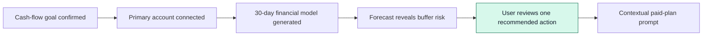

# The Solution · FinWise

Module 2 · Acquisition & Activation. The onboarding solution and the Aha moment that makes value land.

Strategy context

FinWise is a financial-management SaaS product for small businesses with a product-led reverse-trial model. Module 1 identified the **Revenue** stage—trial to paid—as the first experiment priority: only **128 of 6,424 trials converted** in the 13-month dataset, a **1.99% trial-to-paid conversion rate**.

The Module 1 hypothesis is that showing eligible trial users a contextual paid-plan continuation prompt will improve trial-to-paid conversion from **1.99% to 2.4%**. Eligibility must follow a demonstrated product-value event, not happen during early setup. Module 2 therefore designs the shortest path from sign-up to that event.

### Candidate Aha moment

> **A trial user reviews a recommended cash-flow action from a first financial model generated using their connected business account.**

This is the first point at which FinWise transforms account data into a clear answer to a practical small-business question—whether cash will remain above a preferred buffer—and suggests a concrete action. Connecting an account is setup; reviewing the modeled recommendation is the candidate value moment.

**Candidate activation event:** `personalized_cashflow_action_reviewed`

This is a testable candidate, not a proven causal event. FinWise should later compare conversion and retention for users who complete it with comparable users who do not.

---

## Onboarding plan

The onboarding path contains **three steps to Aha**. The paid-plan prompt is a distinct post-Aha treatment in the Module 1 Revenue experiment, not a prerequisite for activation.

| Stage | Single job | One user action | Personalization / friction removal | Event or output |
| --- | --- | --- | --- | --- |
| **1. Confirm first goal** | Establish the first financial question FinWise will answer. | Confirm **“See my upcoming cash flow.”** | For users arriving from a cash-flow template, guide, or campaign, pre-fill this goal; when confidence is high, skip the screen entirely. Users with unknown intent see one goal question, not a multi-question quiz. | First goal confirmed. |
| **2. Connect primary account** | Get the minimum real data needed for the first model. | Select **“Connect account.”** | Ask for one primary business account only. Do not ask for manual categorization, additional accounts, company-profile details, or team invitations. | Account connected / data imported. |
| **3. Review personal cash-flow action** | Turn the connected account data into a forecast and concrete recommended action. | Select **“Review recommended action.”** | The screen uses the connected account and the chosen goal to make the first result personal and focused. | `personalized_cashflow_action_reviewed` — candidate Aha event. |
| **Post-Aha treatment** | Offer continued paid access only after the user has seen value. | Select **“Continue to paid plan.”** | Include **“Not now — continue my trial”** as a clear secondary choice. No discounts, pressure, or complex pricing comparison. | Module 1 treatment; trial-to-paid conversion. |

### Deliberately excluded before Aha

- Product tour and feature menus
- Additional account connections
- Team invitations
- Manual transaction categorization
- Notification preferences and settings
- Billing, pricing comparison, or upgrade prompts before the post-Aha treatment

---

## Prototype mapping

| Prototype view | Role in the onboarding strategy |
| --- | --- |
| **“Let’s get your cash flow clear.”** | Step 1: confirms the cash-flow goal. The prototype shows it pre-filled from a cash-flow guide, preserving acquisition intent. |
| **“Connect your primary business account.”** | Step 2: explains that one account is sufficient, then captures the minimum data required for the forecast. The disconnected and connected-account views are states of the same step. |
| **“Here’s your first cash-flow forecast.”** | Step 3: shows a 30-day forecast, flags the projected buffer shortfall, and offers one recommended action: review invoices due this week. |
| **“Keep your cash flow working for you.”** | Post-Aha treatment: reinforces the value the user just saw and provides the contextual paid-plan continuation prompt. |

---

## Aha-moment prototype

The Aha is engineered on the forecast screen, not on account connection or dashboard arrival. The prototype makes the causal chain visible:

On the prototype’s forecast screen, the user sees a projected low cash balance, the timing of the projected buffer breach, and a specific invoice-review action. Selecting **“Review recommended action”** completes the candidate Aha event. Only then does the next screen offer the paid-plan continuation prompt that Module 1 will test.

---
## Published prototype

[Open the FinWise onboarding prototype](https://finwise-onboarding-p-7fon.bolt.host)

---

## Experiment readout

| Item | Definition |
| --- | --- |
| Population | New reverse-trial users who connect a primary account. |
| Control | The existing post-Aha trial experience, without the contextual continuation prompt at that moment. |
| Treatment | The prototype’s post-Aha continuation prompt, shown immediately after `personalized_cashflow_action_reviewed`. |
| Primary metric | Trial-to-paid conversion rate. |
| Success threshold | Increase from 1.99% to at least 2.4%. |
| Activation diagnostic | Percentage of new trials completing `personalized_cashflow_action_reviewed`. |
| Guardrails | Bank-connection failure rate, onboarding abandonment, time to Aha, and data-import / financial-modeling completion.
