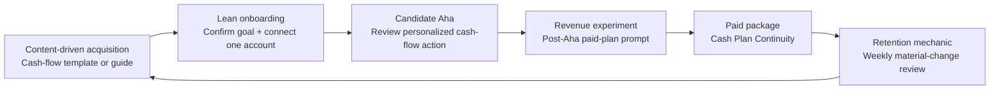

# FinWise — A Product-Led Growth Strategy

> **FinWise can improve trial-to-paid conversion by getting new users to one personalized cash-flow action quickly, then packaging the ongoing value of a current cash plan behind a timely paid boundary.**

*Maliha Jahan · Product Experimentation · August 27, 2026*

This repository is my final project for the **Product Experimentation Certification**: an experimentation-led growth strategy for FinWise, a financial-management SaaS product for small businesses. Each module advances one connected decision; this README is **The Story** that connects the evidence, product experience, engagement mechanic, measurement system, validation plan, and pricing recommendation.

---

## The starting point

FinWise has reached product-market fit and **$10M ARR**, but the growth system is constrained at conversion and durable use:

- Only **128 of 6,424 trials converted to paid** across the 13-month dataset: **1.99%**.
- Paid-customer one-year retention is **40%**, meaning 60% churn within a year.
- Data import averages **39.04%** and financial-modeling usage averages **36.73%**; fewer than half of users reach either observable prerequisite to the first personalized value moment.
- The business relies heavily on paid acquisition, so increasing spend is no longer a meaningful growth strategy on its own.

The strategy therefore focuses on extracting more recurring value and revenue from the trial users FinWise already acquires.

---

## Deliverables at a glance

| # | Module | Deliverable | Key decision |
| --- | --- | --- | --- |
| 1 | [**The Bet**](01-bet/README.md) | Growth hypothesis, Revenue bet, and content-driven growth loop | Show a paid-plan continuation prompt only after users experience personalized value. |
| 2 | [**The Solution**](02-solution/README.md) | Onboarding plan, Aha definition, and published prototype | Get new trials from sign-up to a personalized cash-flow action in the fewest possible steps. |
| 3 | [**The Mechanic**](03-mechanic/README.md) | Cash Plan Freshness mechanic, rationale, and wireframe | Earn a weekly return when a material cash-flow change makes a plan stale. |
| 4 | [**The Signals**](04-signals/README.md) | Metrics priority and signal diagnosis | Instrument the value sequence and use trial-to-paid conversion as proof. |
| 5 | [**The Validation**](05-validation/README.md) | A/B experiment brief | Test the post-Aha paid-plan prompt with a clean user-level experiment. |
| 6 | [**The Model**](06-model/README.md) | Pricing and packaging recommendation memo | Package paid value around ongoing Cash Plan Continuity, not the first insight. |

---

## The Story

### Growth thesis

FinWise should preserve the first personalized cash-flow insight as the activation experience, then monetize the recurring need to keep that insight current. The loop is: **content intent → account import → first financial model → personalized action review → paid Cash Plan Continuity → weekly return when material conditions change.**

### One friction

The most important friction is not yet a UI problem—it is a measurement problem. The available data reports aggregate import and modeling usage but cannot show which individual users completed the full sequence or whether those same users converted. The strategy therefore treats `personalized_cashflow_action_reviewed` as a candidate Aha event and instruments the complete journey before claiming causality.

### One Aha

The Aha moment is when a trial user **reviews a recommended cash-flow action from a first financial model generated using their connected business account**. Connecting data is setup; the forecast becomes valuable when it identifies a possible cash-buffer issue and gives the owner one concrete action, such as reviewing invoices due this week.

### Three takeaways

1. **Activation is a chain, not a screen.** FinWise must remove nonessential steps between account connection, the first model, and an actionable recommendation.
2. **A paid boundary should follow value, not interrupt it.** The Module 5 A/B test asks whether a post-Aha prompt converts users more effectively than the current experience.
3. **Retention requires earned returns.** Cash Plan Freshness does not create a fake streak; it creates a weekly reason to return when a material forecast change affects the user’s financial plan.

---

## The strategy, end to end



### The experiment sequence

1. Use the Module 2 onboarding flow to raise early account-import and personalized-action-review rates.
2. Randomize users after `personalized_cashflow_action_reviewed` and test the contextual paid-plan continuation prompt against control.
3. Measure trial-to-paid conversion over the full reverse-trial period; do not ship based on prompt clicks.
4. Maintain the Cash Plan Freshness mechanic only when a material forecast change creates a genuine reason to return.
5. Package paid access around automatic forecast refreshes, material cash-buffer alerts, weekly action reviews, and additional connected accounts.

---

## Metrics that govern the strategy

| Layer | Metric | Role |
| --- | --- | --- |
| **Aim · North Star** | New trial users who import financial data and reach a first model output within seven days. | Proves early core value has been delivered. |
| **Move · Leading 1** | Primary-account import rate within 24 hours of sign-up. | Measures the first prerequisite to a personalized forecast. |
| **Move · Leading 2** | Personalized cash-flow action-review rate within seven days of account import. | Captures the candidate Aha behavior and eligibility for the paid-prompt test. |
| **Prove · Lagging** | Trial-to-paid conversion over the reverse-trial period. | Confirms that more users reaching value creates commercial impact. |

The trial-to-paid trend remains in a narrow **1.87%–2.08%** band, a low conversion ceiling. Financial-modeling usage is volatile, and its correlation with trial-to-paid conversion is weak (**Pearson r = 0.26**). That finding reinforces the need for user-level event instrumentation and randomized testing rather than relying on monthly aggregate feature usage.

---

## Published onboarding prototype

[Open the FinWise onboarding prototype](https://finwise-onboarding-p-7fon.bolt.host)

---

## Repository structure

```text
finwise-strategy/
├── README.md                 ← The Story
├── 01-bet/README.md          ← M1: growth hypothesis, bet, and growth loop
├── 02-solution/README.md     ← M2: onboarding, Aha moment, and prototype
├── 03-mechanic/README.md     ← M3: engagement mechanic and wireframe
├── 04-signals/README.md      ← M4: metrics priority and signal diagnosis
├── 05-validation/README.md   ← M5: experiment brief
└── 06-model/README.md        ← M6: pricing and packaging memo
```

---

*Certification submission — Product Experimentation Certification.*
